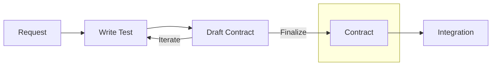
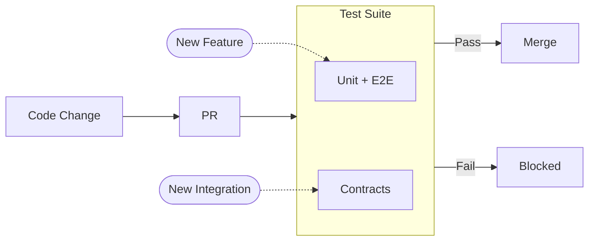

이 사례는 **테스트로서의 계약(Tests as Contracts)** 패턴을 보여줍니다: Actionbase가 약속된 동작을 유지하면서 어떻게 지속적으로 발전했는지에 대한 이야기입니다.

## 테스트로서의 계약이란 무엇인가? {#what-is-tests-as-contracts}

**테스트 = 명세 = 문서 = 보호 장치.** 하나의 진실된 소스.

서비스 팀이 Actionbase와 통합할 때, 우리는 수동 문서를 작성하지 않습니다. 대신 시나리오 테스트를 공동 작성합니다. 이 테스트는 다음과 같은 역할을 합니다:

- 계약(스키마, 뮤테이션, 쿼리)을 정의합니다
- 문서를 자동으로 생성합니다
- 모든 PR에서 실행되어 프로덕션 변경 전에 게이트 역할을 합니다

테스트가 통과하면 약속이 유지됩니다. 실패하면 변경이 차단됩니다.

## 이것이 필요했던 이유 {#why-we-needed-this}

서비스들은 특정 동작(페이지네이션 크기, 인덱스 필터, 쿼리 방향, 배치 의미론, 일관성 보장 등)에 의존합니다. 한 팀은 타임스탬프 내림차순 정렬을 필요로 하고, 다른 팀은 배치당 정확히 100개의 아이템을 기대합니다. 이들을 결합하면 가능한 사용 패턴의 수가 기하급수적으로 증가합니다.

우리는 단위 테스트도 있고, E2E 테스트도 있습니다. 최선을 다하지만, 그럼에도 모든 약속된 사용 패턴이 계속 동작할지 100% 확신할 수 없었습니다. 우리는 기존 통합을 깨뜨리지 않으면서 지속적으로 발전할 수 있는 방법이 필요했습니다. 계약 테스트는 그 공백을 메우며, 우리가 약속한 내용을 정확히 보장합니다.

## 동작 방식 {#how-it-works}

### 1. 통합: 테스트가 계약이 됩니다 {#1-integration-tests-become-contracts}



서비스 팀이 Actionbase와 통합하고자 할 때, 프로세스는 구체적인 요청으로 시작됩니다:

"사용자의 가장 최근 10개의 위시리스트를 타임스탬프 내림차순으로 정렬해서 받아야 합니다."

문서를 작성하는 대신, 우리는 시나리오 테스트를 함께 작성합니다. 이 테스트는 다음을 정의합니다:

- 스키마(엣지, 프로퍼티, 인덱스)
- 뮤테이션(생성, 수정, 삭제)
- 쿼리(정확한 액세스 패턴, 제한, 정렬)

이 테스트는 예제가 아닙니다. 계약입니다.

그 테스트에서 문서가 자동으로 생성됩니다. 테스트가 실행되면 스키마 정의, API 예제, 쿼리 의미가 `.mdx` 파일로 생성되고, CI가 이를 문서 사이트에 배포합니다. 서비스 팀이 검토합니다. 반복합니다. 테스트를 조정합니다. 테스트 작성은 수작업입니다. 그 이후의 모든 과정은 자동화됩니다.

모두가 동의하면 계약이 확정되며, 양측 모두의 승인이 있어야 변경이나 종료가 가능합니다. 그 순간 테스트는 단순한 테스트가 아닌 약속이 됩니다.

우리가 작성하는 계약은 서비스가 의존하는 사용 패턴을 포괄합니다. 이 계약을 작성하는 데 더 많은 노력이 들지만, 우리는 신뢰를 위해 이 방식을 선택했습니다.

### 2. 보호: 잠긴 계약이 프로덕션을 지킨다 {#2-protection-locked-contracts-guard-production}



잠긴 계약은 양측이 동의할 때까지 유지됩니다. 새 기능 추가 시에는 단위 테스트와 E2E 테스트가, 새 통합 추가 시에는 계약 테스트가 실행됩니다.

- **단위 + E2E 테스트** — 새 기능을 추가할 때
- **계약 테스트** — 새 통합을 추가할 때

모든 테스트가 통과하면 변경 사항이 배포됩니다. 계약 하나라도 실패하면 PR은 병합될 수 없습니다. 우리가 명시적으로 약속한 모든 내용에 대해, "이 변경이 합리적인가?"가 아니라 "우리가 약속한 내용을 위반하는가?"를 묻습니다.

## 계약과 함께 살아가기 {#living-with-contracts}

### 같은 테이블, 다른 계약 {#same-table-different-contracts}

하나의 테이블에 여러 계약이 존재할 수 있습니다. 서비스 A는 배치 내보내기를 위해 한 번에 100개 항목을 가져오고, 서비스 B는 모바일 UI를 위해 한 번에 10개씩 페이지네이션합니다. 서비스 C는 실시간 카운터에 대해 강한 일관성을 요구하고, 서비스 D는 분석을 위해 최종적 일관성을 허용합니다. 각 사용 패턴마다 별도의 계약이 독립적으로 보호됩니다.

### 계약의 진화 {#evolving-contracts}

서비스 요구사항에 따라 계약이 진화하며, 각 변경마다 버전이 증가합니다. 이전 버전은 서비스가 마이그레이션될 때까지 유지됩니다.

## 전통적인 계약 테스트와의 차이점 {#how-we-differ-from-traditional-contract-testing}

전통적인 계약 테스트(예: Pact)는 API 형태—요청과 응답 포맷—에 집중합니다. 우리의 계약은 더 깊이 들어가 사용 패턴을 포착합니다. 단순한 인터페이스가 아닙니다.

|                | Traditional           | Actionbase             |
| -------------- | --------------------- | ---------------------- |
| **Scope**      | API shape             | Usage patterns         |
| **Docs**       | Separate              | Generated from tests   |
| **Guarantees** | Payload compatibility | Behavior compatibility |

## 우리가 배운 점 {#what-we-learned}

- **계약은 문서가 아니라 약속입니다.** 모든 통합은 약속입니다. 테스트는 모든 PR에서 그 약속을 강제합니다.
- **진화하는 시스템에는 가드레일이 필요합니다.** Actionbase는 완성된 적이 없습니다. 새로운 기능, 최적화, 새로운 스토리지 백엔드가 계속 추가되었습니다. 그러나 모든 변경은 모든 약속이 테스트되었기 때문에 안전했습니다.
- **신뢰는 선의가 아닌 보장으로부터 비롯됩니다.** 서비스 팀은 더 이상 "이것이 우리를 망가뜨릴까?"라고 묻지 않습니다. 계약이 통과되면 안전하다는 사실을 알고 있기 때문입니다.

## 부록: 계약 테스트 구조 {#appendix-contract-test-structure}

다음은 계약 테스트가 어떻게 구성되는지 보여주는 간략화된 의사 코드 예시입니다. 실제 구현은 세부 사항이 다르지만, 핵심 개념은 동일하게 유지됩니다.

```kotlin
@Contract(
    service = "gift",
    feature = "wish",
    outputDir = "services/gift/wish",  // generated docs go here
)
class WishContract {
    val context = Context.from(WishTable)

    // inner class -> .mdx file
    // test method -> section in the file

    inner class Schema : SchemaSpec(context) {      // -> schema.mdx
        @Spec fun schema() = defineSchema()         //    ## Schema
        @Spec fun sampleData() = createSampleData() //    ## Sample Data
    }

    inner class Operations : OperationSpec(context) { // -> operations.mdx
        @Spec fun createDatabase() = ddl.createDatabase()
        @Spec fun createTable() = ddl.createTable()
    }

    inner class Integration : IntegrationSpec(context) { // -> integration.mdx
        @Spec(title = "Insert edge")  // ## Insert edge
        fun insert() {
            mutate(edge, INSERT)
        }

        @Spec(title = "Get edge")     // ## Get edge
        fun get() {
            val result = get(source = "user-123", target = "product-456")
            assertEquals(1, result.count)
        }

        @Spec(title = "Scan edges")   // ## Scan edges
        fun scan() {
            val result = scan(source = "user-123", direction = OUT, limit = 10)
            assertSortedByTimestampDesc(result)
        }

        @Spec(title = "Count edges")  // ## Count edges
        fun count() {
            val result = count(source = "user-123", direction = OUT)
            assertEquals(5, result.value)
        }
    }
}
```

테스트 프레임워크는 JUnit 확장 기능을 기반으로 구축됩니다. 각 내부 클래스는 `.mdx` 파일을 생성하고, 각 테스트 메서드는 해당 파일 내의 섹션으로 변환됩니다.

계약 테스트 프레임워크는 현재 릴리스에 포함되어 있지 않습니다. 내부 세부 사항이 아직 정제 중이기 때문입니다. 우리는 이를 점진적으로 오픈소스로 공개할 계획이며, 누구나 계약에 기여할 수 있는 모델도 검토 중입니다. 그 전까지는 발표와 프레젠테이션을 통해 가능한 정보를 공유할 예정입니다. 업데이트는 [로드맵](/ko/community/roadmap/)에서 확인할 수 있습니다.
